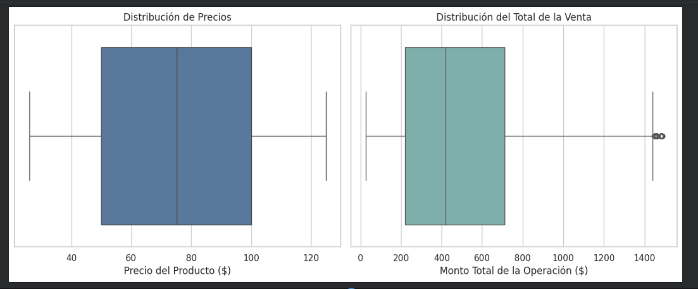
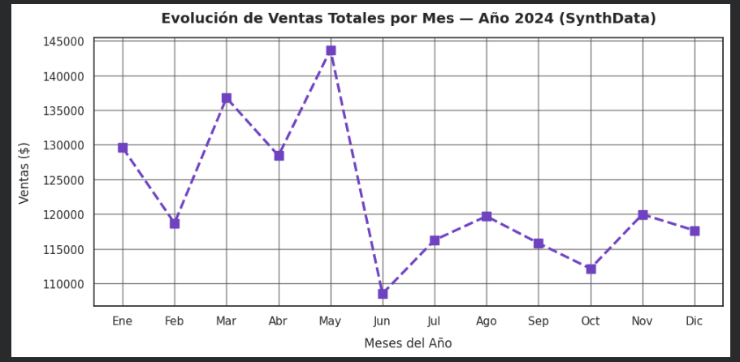
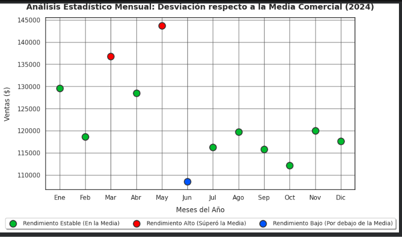
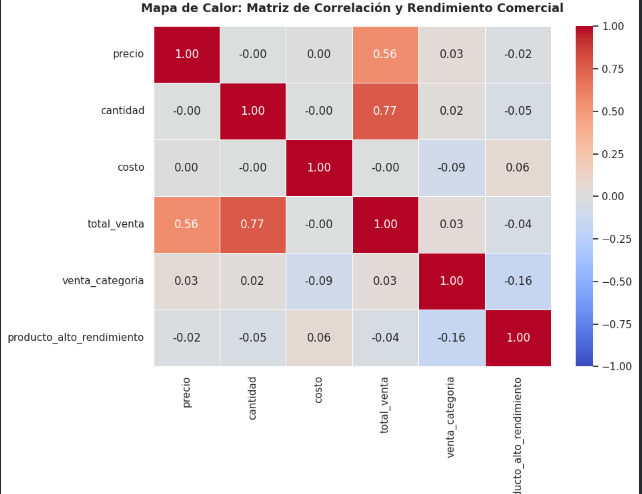
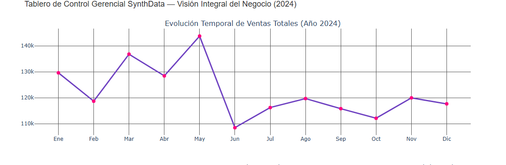
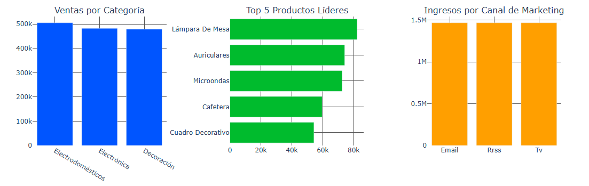

# 📊 Análisis de Rendimiento Comercial - SynthData (Data Analytics)

## 📝 Descripción del Proyecto y Objetivos Estratégicos
Este proyecto es un análisis integral de datos transaccionales y de marketing para "SynthData". A través de un riguroso proceso de limpieza de datos, análisis estadístico y visualización, el objetivo principal es transformar tablas crudas en información estratégica (insights) para la toma de decisiones ejecutivas. 

A través de un enfoque analítico sustentado en Python, este proyecto busca:
* Evaluar la consistencia y distribución de las operaciones transaccionales.
* Identificar patrones estacionales y desviaciones respecto a la media comercial.
* Auditar la correlación estadística entre variables operativas del negocio.
* Facilitar la toma de decisiones ejecutivas mediante la visualización interactiva de categorías y canales de marketing.

📄 **[Haz clic aquí para leer la Presentación/Informe Final en PDF](./SynthData_2024_Presentacion.pdf)**

## 🛠️ Tecnologías y Herramientas
* **Lenguaje:** Python
* **Análisis y Manipulación de Datos:** Pandas, NumPy
* **Visualización:** Plotly, Matplotlib / Seaborn
* **Entorno de Desarrollo:** Google Colab / Jupyter Notebook

## 🚀 Cómo ejecutar este proyecto

Los datasets originales (`.csv`) se encuentran incluidos en este repositorio para garantizar la reproducibilidad del análisis.

**Opción 1: Google Colab (Recomendado)**
Puedes abrir y ejecutar el proyecto directamente en tu navegador sin instalar nada. Simplemente ingresa al cuaderno (`.ipynb`) que se acompaña en este repositorio y haz clic en el botón de **"Open in Colab"** que se encuentra en la parte superior del archivo.

**Opción 2: Clonar el repositorio localmente**
```bash
git clone [https://github.com/NoeliaOrsini/synthdata-data-analytics.git](https://github.com/NoeliaOrsini/synthdata-data-analytics.git)
cd synthdata-data-analytics
```

---

## ⚙️ Metodología y Resultados Visuales

### 1. Distribución y Varianza de Datos
Antes de agrupar, se analizó la dispersión de los precios y los montos totales para comprender el comportamiento de las operaciones y detectar valores atípicos (outliers).


### 2. Evolución Temporal y Tendencia Mensual
El comportamiento comercial de 2024 muestra una fuerte dinámica estacional. Al analizar las ventas totales mes a mes, se identifica claramente un pico histórico de rendimiento en mayo, seguido inmediatamente por la contracción más marcada del año en junio.


Asimismo, al evaluar estas métricas contra la media comercial del año, se visualizan con precisión las desviaciones operativas y los meses que operaron a pérdida respecto al promedio.


### 3. Análisis Estadístico de Correlación
Se elaboró una matriz de correlación utilizando el coeficiente de Pearson para evaluar el grado de asociación lineal entre las distintas variables numéricas operativas y las métricas de rendimiento consolidadas.


### 4. Dashboard Gerencial Interactivo
Como cierre del proyecto, se desarrolló un Tablero de Control integral que permite auditar el negocio desde la tendencia macro temporal hasta el detalle micro de sus productos y canales.

**Evolución Temporal de Ventas Totales (Año 2024)**


**Rendimiento por Categoría, Productos Líderes y Canales de Marketing**


---

## 💡 Conclusiones y Siguientes Pasos
* **Optimización de Stock:** Los productos de la categoría *Electrodomésticos* y los identificados en el top de alto rendimiento (percentil 75) requieren prioridad en la cadena de suministro.
* **Estrategia Estacional:** Diseñar campañas de marketing agresivas previas a junio para mitigar la caída estacional identificada en el análisis temporal.
* **Eficiencia de Canales:** Dado el rendimiento parejo entre Email, RRSS y TV, se recomienda auditar los costos de adquisición por cliente (CAC) en cada medio para optimizar el presupuesto asignado.

---

## ⚠️ Aclaración Legal y sobre los Datos (Disclaimer)
Este proyecto fue desarrollado de forma exclusiva como Trabajo Práctico Integrador para obtener la certificación de **Analista de Datos** otorgada por **Talento Tech**.
* **Naturaleza de los Datos:** "SynthData" es una empresa completamente ficticia. Todos los datos (ventas, precios, costos) utilizados en este repositorio han sido generados de manera sintética. No se expone información real de terceros, garantizando el cumplimiento de los estándares de ética profesional y normativas locales e internacionales de protección de datos.
* **Archivos Complementarios:** En este repositorio se incluyen los archivos `.csv` crudos y una presentación ejecutiva en PDF (exportada desde el notebook) con el detalle visual de los gráficos analizados.

---

## 👩‍💻 Autora

**Noelia Orsini**

Soy Abogada, Counselor y Programadora. Actualmente trabajo en la intersección del derecho con la tecnología aportando una mirada humana. Además, me encuentro en constante perfeccionamiento en inteligencia artificial, análisis de datos y procesos de automatización mediante el uso de arquitecturas RAG y metodologías *Human-in-the-Loop* (HITL).

🔗 https://www.linkedin.com/in/noelia-orsini
